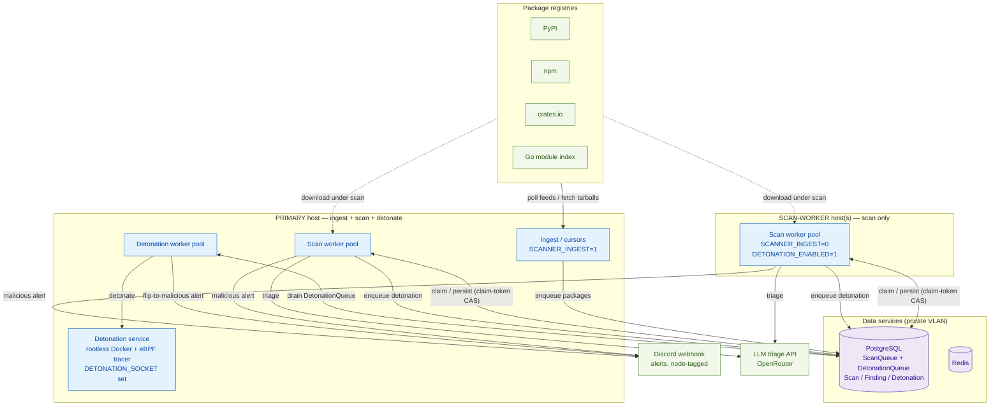
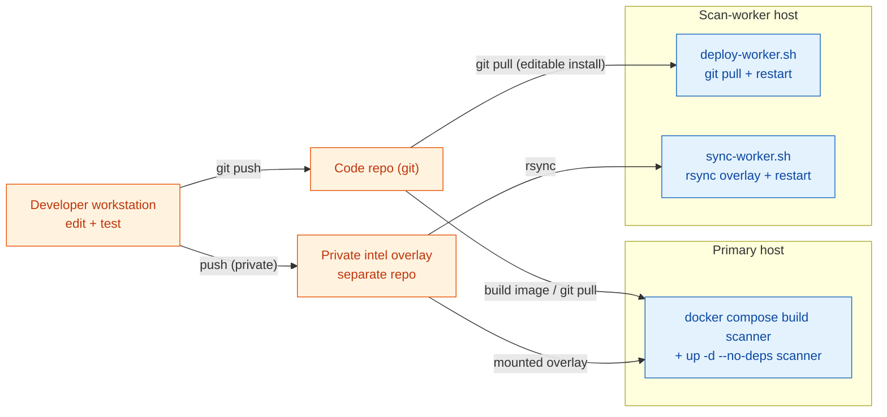
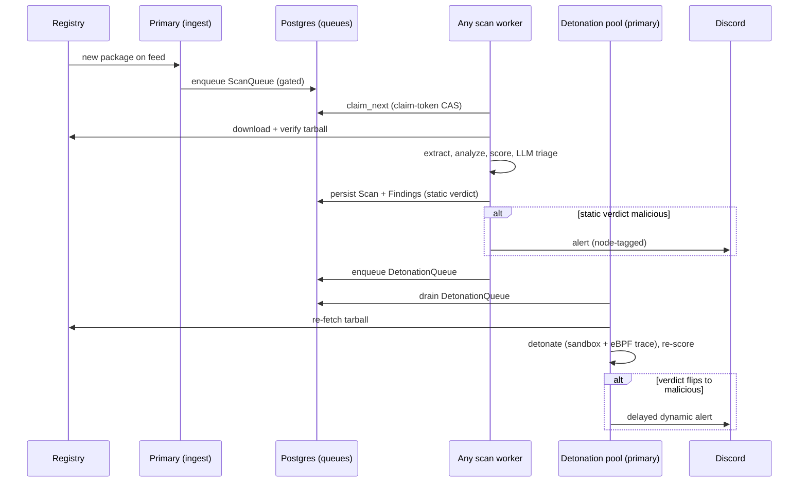
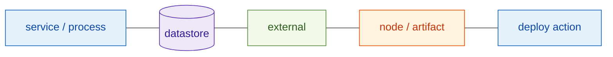

# Deployment topology

How pkgward runs as a **multi-host cluster**: one primary host that ingests +
scans + detonates, plus any number of scan-only worker hosts, all coordinated
through a single shared database. Complements the scan-*pipeline* diagrams in this
directory (`scan-pipeline.drawio` et al.) — those show what happens *inside* one
`process_one`; this shows where those processes *run* and how work is shared.

Grounded in: `docs/operations.md` ("Scaling horizontally"), `runtime.py`
(`_async_run` starts the worker + detonation pools), `queue.py` (`claim_next`,
claim-token CAS), `pkgward/detonation_worker.py`, and the env vars in
`CLAUDE.md` (`SCANNER_INGEST`, `DETONATION_ENABLED`, `DETONATION_SOCKET`).

> Roles, not hosts. A concrete site fills these roles with specific machines; this
> diagram is intentionally generic so it stays valid as hosts come and go.

## 1. Topology — who runs what

**Key invariants**
- **One ingest source.** Only the primary runs `SCANNER_INGEST=1`; workers never
  enqueue, they only drain — so the feed cursor advances once, not per host.
- **DB is the only coordination.** No host talks to another directly. Both queues
  are claimed with a claim-token CAS (`queue.claim_next`), so N hosts scale almost
  linearly without a broker.
- **Detonation lives where the sandbox is.** Worker hosts have no detonation
  service; `DETONATION_ENABLED=1` makes their scans *enqueue* detonation jobs that
  the primary's detonation pool drains (`detonation_worker.py`).
- **Alerts are decentralised.** Any host can fire a Discord alert; the footer
  carries the node id + build SHA (`node_id.py`) so you can tell which fired it.

## 2. Code + intel deploy flow — how an update reaches each host

Two payloads ship on different rails: the **engine code** (image or git checkout)
and the **private intel overlay** (rules / prompts / thresholds, read once at
process start). Ordering matters — see the note.

> **Deploy order on a worker:** run `sync-worker.sh` (intel) **before**
> `deploy-worker.sh` (code). The overlay is read at startup; a new baseline rule
> that references overlay data must not restart against a stale overlay, or the
> YARA compile fails. Both verify recovery via the `intel_loaded
> source=baseline+overlay` log line. (See `docs/operations.md`.)

## 3. Work distribution — a package from ingest to alert

## Maintenance

- **Tied to:** `runtime.py::_async_run` (pool startup + sizing), `queue.py`
  (`claim_next` scheduling + claim-token), `pkgward/detonation_worker.py`,
  `pkgward/node_id.py` (alert identity), `docs/operations.md` ("Scaling
  horizontally", "Code + intel deploys to worker hosts").
- **Update when:** the ingest/scan/detonation split changes, a new coordination
  channel is added (today it's DB-only), or the deploy tooling changes.
- **Deliberately generic** — no host names, IPs, or counts. A concrete site's map
  (specific hosts, network segmentation, tunnels) is maintained as private
  operational documentation, not here.

### Legend

